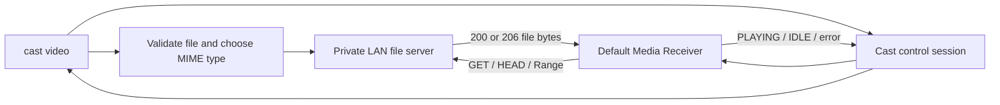

# Local video casting plan

- Status: implemented; physical receiver validation pending
- Target release: `v0.3.0`
- Planning branch: `codex/video-casting`

## Scope assumption

In this plan, “casting video” means playing a video file stored on the Mac. Cast already has
`url` for media that is available at a receiver-accessible URL. The new feature should make a
local file receiver-accessible, load it as buffered media, and keep serving it for the lifetime of
playback.

The first milestone is direct playback without remuxing or transcoding. This is the smallest useful
feature, preserves the source quality, uses negligible CPU, and exercises the transport and Cast
session behavior that every later compatibility mode will also need.

## Proposed user experience

```sh
# Play a compatible local file
cast video \
  --host 192.168.1.50 \
  ~/Movies/example.mp4

# Begin at a particular position
cast video \
  --host 192.168.1.50 \
  --start-at 90 \
  ~/Movies/example.mp4

# Select a fixed HTTP port for firewall or diagnostic purposes
cast video \
  --host 192.168.1.50 \
  --http-port 8080 \
  ~/Movies/example.mp4
```

Recommended CLI shape:

```text
cast video [OPTIONS] <FILE>

Arguments:
  <FILE>                    Local video file

Options:
  --host <IP>               Chromecast address; required
  --cast-port <PORT>        Cast control port; default 8009
  --http-port <PORT>        Local media port; default 0 (automatic free port)
  --start-at <SECONDS>      Initial playback position; default 0
  --content-type <TYPE>     Override automatic MIME detection
```

`--port` can remain an alias for `--cast-port` so the option is compatible with `url`. The
default output should show the selected file, advertised media type, receiver state transitions,
and a `Ctrl-C` instruction. HTTP request details belong under `-v`; headers and Cast protocol
details belong under `-vv`.

Cast should continue running while the receiver can fetch the file. It should stop when any of
these occur:

- the receiver reports that playback finished;
- the receiver reports a terminal load or playback error;
- another sender replaces the media session;
- the user presses `Ctrl-C`.

On `Ctrl-C`, Cast should send a best-effort media `STOP`, close the Cast session, and then stop
the file server.

## Why this design fits Google Cast

Google’s Default Media Web Receiver is explicitly designed to load an audio or video URL supplied
by the sender. Its media description contains a content URL/ID, MIME type, stream type, and optional
duration. A local filesystem path is not meaningful to a Chromecast, so Cast must expose the file
over the LAN and load the resulting HTTP URL.

Google documents MP4 and WebM among the supported containers, but actual codec, profile,
resolution, frame-rate, and HDR support differs by receiver model. The documented delivery modes
also include progressive download. The initial feature should therefore advertise buffered media,
serve compatible files unchanged, and report receiver compatibility errors rather than claiming
that every file will play.

References:

- [Google Cast Web Receiver overview](https://developers.google.com/cast/docs/web_receiver)
- [Supported Media for Google Cast](https://developers.google.com/cast/docs/media)
- [Cast `MediaInformation` reference](https://developers.google.com/cast/docs/reference/web_receiver/cast.framework.messages.MediaInformation)
- [Google Cast receiver error codes](https://developers.google.com/cast/docs/web_receiver/error_codes)
- [RFC 9110 HTTP range semantics](https://www.rfc-editor.org/rfc/rfc9110.html#name-range-requests)

## Existing foundation

The repository already has most of the control-plane pieces:

- `src/cast.rs` launches the Default Media Receiver and loads buffered or live URLs;
- the vendored `rust-cast` media channel already supports load, play, pause, seek, and stop;
- `src/live.rs` selects the Mac address used to route to the receiver, binds only that LAN
  interface, generates an unguessable session path, and runs a small HTTP server;
- receiver status and detailed media errors are already parsed and logged;
- the release workflow already bundles the CLI and end-user documentation.

The important gaps are:

1. The HLS HTTP server serves in-memory objects only and does not implement byte ranges.
2. `cast_url` reports success after the initial `LOAD` response, before proving that playback
   reached `PLAYING`.
3. The Cast control connection is owned by a detached monitoring thread and does not expose a
   controllable session lifecycle to its caller.
4. There is no local-file validation, media-type detection, or user-facing mapping of receiver
   errors.
5. The current HTTP URL formatting and tests do not cover local VOD, large files, seeking, or IPv6.

## Architecture



New code should be separated into three responsibilities:

- `video.rs`: validates options, prepares the file, starts the server, loads the receiver, and
  manages shutdown;
- `media_server.rs`: exposes exactly one already-open file with bounded HTTP parsing and byte-range
  responses;
- `cast.rs`: exposes a reusable buffered-media session and typed status events instead of only a
  fire-and-monitor helper.

Only small networking helpers should be extracted from `live.rs` initially: route-based local IP
selection, IPv4/IPv6 URL formatting, and random route generation. The working HLS server should not
be broadly rewritten as part of this feature.

## HTTP file server contract

The receiver needs random access for startup and seeking, especially when an MP4 metadata box is at
the end of a file. The server must support:

- `GET` and `HEAD`;
- a full response (`200 OK`) when no range is requested;
- a single closed, open-ended, or suffix byte range (`206 Partial Content`);
- `Accept-Ranges: bytes` on file responses;
- correct `Content-Range` and `Content-Length` headers;
- `416 Range Not Satisfiable` plus `Content-Range: bytes */<length>` for an unsatisfiable range;
- `Content-Type`, `Access-Control-Allow-Origin: *`, and conservative CORS response headers;
- a fixed upper bound on request-header size and read/write timeouts;
- streaming in bounded chunks rather than loading the file into memory.

Multiple ranges in one request can be ignored and answered with a full `200 OK` in the first
version; multipart range responses are not needed for the expected receiver behavior. This
limitation must have a focused test and a clear diagnostic log.

The file should be opened and its length captured before the server starts. On macOS, offset-based
reads from that stable handle avoid shared seek-position races between simultaneous requests and do
not expose any other path. The URL should contain a fresh 128-bit random route and use an automatic
ephemeral port by default. The listener must bind only to the route-selected LAN interface, never
all interfaces.

## Media compatibility policy

Milestone one should support passthrough for these documented container families:

| File family | Advertised type | Initial policy |
| --- | --- | --- |
| MP4 / M4V with MP4-compatible contents | `video/mp4` | Supported, receiver decides codec compatibility |
| WebM | `video/webm` | Supported, receiver decides codec compatibility |
| Other or unidentified containers | User override only | Fail before casting with actionable guidance |

An extension is not proof that its codecs are supported. At minimum, Cast should inspect the file
signature so a renamed or clearly invalid file fails early. A later inspection slice can parse track
metadata and add codec parameters such as H.264/AAC to the advertised MIME type.

MOV, MKV, AVI, and protected/DRM media are not part of the direct-play compatibility promise.
Some may contain codecs that a receiver can decode, but their containers are not all in Google’s
documented list. They should eventually flow through remux or transcode rather than being silently
advertised as MP4.

Receiver errors must be promoted from verbose logs into normal command failures. In particular:

- media network errors should point to the Mac firewall, LAN isolation, and HTTP request log;
- media decode errors should identify a corrupt or incompatible encoding;
- source-not-supported errors should identify container/codec incompatibility and list the
  documented direct-play choices;
- a load acknowledgement followed by an asynchronous failure must still make the command fail.

## Cast session lifecycle

Refactor the current control thread behind an owned handle, conceptually:

```rust
let session = CastSession::start(receiver, BufferedMedia { /* ... */ })?;
session.wait_until_playing(startup_timeout)?;

while let Some(event) = session.next_event()? {
    // Update status or finish on a terminal event.
}
```

The exact API can differ, but it needs these properties:

- the `CastDevice` remains on one control thread;
- commands travel to that thread over a channel;
- typed status, error, and terminal events travel back to the caller;
- the initial media session ID and receiver transport ID are retained for stop and future controls;
- `Drop` cannot silently leave a joinable thread or deadlock on a blocking receive;
- existing `url` and HLS callers retain their current behavior.

Reaching `PLAYING` is the success boundary for `video`; receiving the synchronous `LOAD`
response is only an acknowledgement. A 20-second startup timeout is a reasonable initial default,
and its failure should include whether the receiver ever requested the file.

## Implementation slices

### 1. Shared network primitives

- Extract route-based local IP selection and random route generation without changing behavior.
- Add correct bracketed IPv6 URL construction.
- Let file serving bind port `0` and return the actual selected port.
- Add unit tests for IPv4/IPv6 URL generation and route validation.

Exit criterion: existing desktop HLS tests and behavior remain unchanged.

### 2. Range-capable single-file server

- Implement the file server contract above.
- Add structured counters for requests, bytes, full responses, ranges, and failures.
- Log method, normalized route, range, response status, and byte count at verbose level.
- Make shutdown prompt even when no receiver is connected.

Exit criterion: loopback tests cover full GET, HEAD, closed/open/suffix ranges, invalid ranges,
unknown routes, unsupported methods, CORS headers, and a file larger than the transfer buffer.

### 3. Owned Cast media session

- Generalize `MediaLoad` so messages say “buffered media” or “live media” correctly.
- Return typed receiver events from the Cast control thread.
- Wait for `PLAYING`, surface asynchronous errors, and support best-effort `STOP`.
- Preserve `url` and `desktop --transport hls` behavior.

Exit criterion: mocked/channel-level tests prove acknowledgement, playing, terminal error, finished,
replacement, timeout, and shutdown paths.

### 4. `video` orchestration and CLI

- Add the subcommand and options proposed above.
- Canonicalize and open the file before contacting the receiver.
- Detect MP4/WebM signatures and choose the default MIME type.
- Start the server before sending `LOAD`, using `StreamType::Buffered`, autoplay, and `--start-at`.
- Keep the process alive until playback ends or `Ctrl-C` is received.
- Print a concise final transfer summary.

Exit criterion: a known-good H.264/AAC MP4 starts, seeks, resumes, completes, and stops cleanly on a
physical receiver without loading the complete file into Cast’s memory.

### 5. Compatibility diagnostics and documentation

- Map Cast detailed errors to actionable CLI messages.
- Document the direct-play matrix and receiver-dependent codec limits.
- Add `video` to the end-user guide, README, help snapshots, and release archive checks.
- Document macOS firewall prompts and why the Mac and receiver must share a reachable LAN.

Exit criterion: an incompatible file fails with guidance rather than a false “accepted” success.

### 6. Compatibility pipeline

Implemented as a separate `--transcode auto|never|always` milestone:

1. inspect container, video, and audio tracks;
2. direct-serve compatible files;
3. remux compatible elementary streams when only the container is unsuitable;
4. decode and hardware-transcode incompatible video through VideoToolbox;
5. encode incompatible audio as AAC through a macOS hardware/native path where available;
6. write a complete fast-start MP4 before playback so seeking and range serving remain reliable.

The pipeline links pinned FFmpeg libraries directly for probing, demuxing, decoding, scaling,
resampling, and muxing; it does not launch FFmpeg command-line programs. H.264 output uses
VideoToolbox. Incremental buffered fMP4 HLS remains a future optimization for starting playback
before a long transcode completes.

## Test matrix

Automated tests should not require a receiver:

- empty, one-byte, and multi-megabyte files;
- files with spaces and Unicode in the source path;
- prefix, suffix, open-ended, last-byte, and unsatisfiable ranges;
- simultaneous non-overlapping range requests;
- slow/disconnected clients and bounded shutdown;
- route token isolation and traversal attempts;
- file removed or renamed after the stable handle is opened;
- start position validation, including negative, non-finite, and beyond-duration values where the
  duration is known;
- correct buffered `Media` and `LoadOptions` construction.

Manual receiver coverage should include:

- H.264 + AAC MP4 on the project’s current Nest Hub-class target;
- MP4 with metadata at both the beginning and end of the file;
- a large file (more than 4 GiB) to catch 32-bit range mistakes;
- WebM on a receiver model that documents the contained codec;
- pause, resume, and seek from another Cast controller;
- an unsupported codec, an invalid file, firewall denial, and receiver replacement;
- both Apple Silicon and Intel release builds.

## Acceptance criteria for the first release

- `cast video --host <ip> <file.mp4>` plays a compatible local file through the Default
  Media Receiver.
- Startup is not reported as successful until the receiver reaches `PLAYING`.
- Seeking works through valid HTTP byte-range responses.
- A multi-gigabyte file is streamed with bounded memory use and 64-bit offsets.
- Only the selected file is reachable, on one random route bound to the receiver-facing interface.
- Terminal receiver errors produce a non-zero exit and an actionable message.
- `Ctrl-C` stops playback and shuts down both network threads promptly.
- Existing `url`, mirroring, HLS, profiling, CI, and release packaging continue to pass.
- The feature is covered in the bundled end-user guide.

## Deferred features

- automatic remuxing or transcoding;
- local subtitles and alternate audio-track selection;
- playlists, queues, repeat, and autoplay-next;
- an interactive terminal controller for pause/seek/volume;
- thumbnails and rich movie metadata;
- DRM or protected streaming services;
- a custom Web Receiver.

The owned Cast session in slice three deliberately leaves room for playback controls and queues, but
none of them should delay the first useful local-file release.
